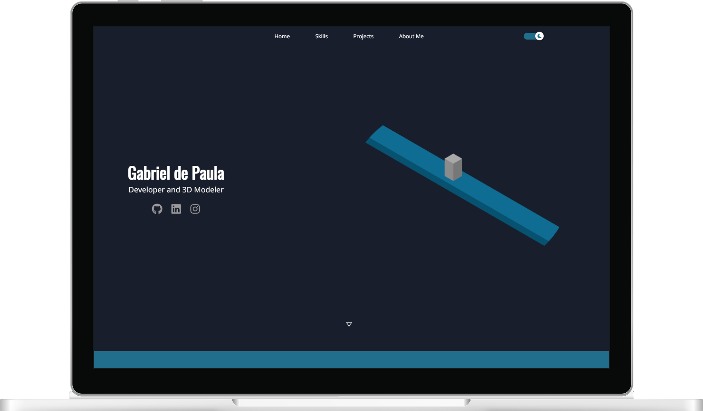
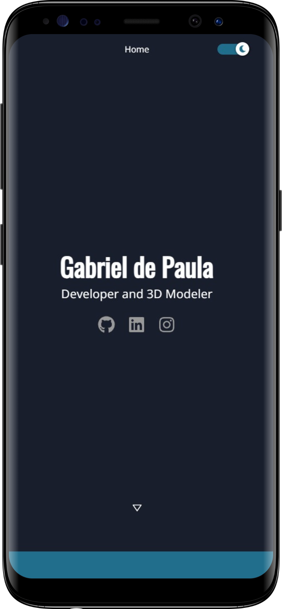

<br/><br/>

<p align=center>
    
</p>
<h1 align=center>Gabriel de Paula's Portfolio</h1>

<p align=center>
    <a href='https://gabrieldp23.github.io/'>gabrieldp23.github.io</a>
    <br/><br/>
    
    &nbsp;
    
    &nbsp;
    
    &nbsp;
    
</p>


<br/><br/>
<p align=center>
    
    &nbsp;&nbsp;&nbsp;&nbsp;
    
</p>
<br/><br/>

## 💡 Motivation

This portfolio aims to show some of my current and future works as a Software Developer and 3D Modeler. 
<br/>
You can see the improvement of the projects along the time and also get to know a little about me and my experiences. 😄

<br/>

## ⚙ Functionalities

These are the main features of the portfolio

|Simple 3D runner minigame|
|-|
|**Theme toggle - light / dark**|
|**User-interactive animations**|
|**GitHub projects section**|
|**"About Me" section**|


### Technic Highlights

|Fully made with React (JavaScript)|
|-|
|**Simple minigame made with Three.js**|
|**Responsive for all devices and screen sizes**|
|**Good project sctructure (easy maintenance)**|
|**Styled with Styled Components**|
|**Deployed with GitHub Pages**|

<br/>

## 📝 Issues

This is the first version of my portfolio, there are some changes and improvements todo. More features will be added in future, if you want to suggest something, contact me!

- [ ] SEO

- [ ] Improve minigame

- [ ] Change informations on "About Me" after February

<br/>

## 🖥 Running locally

```bash
# Clone
git clone https://github.com/gabrieldp23/gabrieldp23.github.io.git

# Node modules
npm install

# Open project on localhost
npm start
```